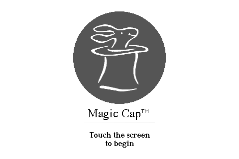
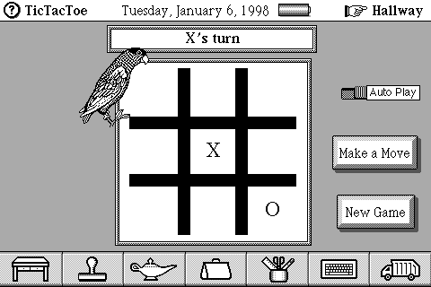

# MagicHat

MagicHat is the low-level Magic Cap emulator for DataRover 840 (MIPS) and
Sony PIC-2000, Sony HIX-300, and Motorola Envoy (68k). It models the CPUs,
boards, peripherals, PC Cards, host I/O, and SDL/Android frontends. HIX-300
and Envoy support has ROM-specific experimental limits; PIC-1000 is recognized
but does not yet have a working board. See [ROM support](docs/ROM_DETECTION.md)
for details. Magic Cap application-development tools live in the separate
[Hatter](https://github.com/christopher-roelofs/Hatter) repo.

## Screenshots

| PIC-2000 (one of the 68k targets) | Magic Cap 3 on MIPS, running TicTacToe |
| --- | --- |
|  |  |

The [networking guide](docs/NETWORKING.md) shows the DataRover's connection
setup and browser running through the emulated NE2000 card.

## Build and run

On Linux, install a C/C++ compiler, CMake, SDL2 development files, and
optionally libslirp for user-mode networking. Then:

```sh
cmake -S . -B build
cmake --build build -j
ctest --test-dir build --output-on-failure
./build/mcap --rom /path/to/your/rom
```

ROMs, memory cards, saved states, and packages are user data. They are not
included in this repository or required to compile it. Keep them outside
the checkout or under the ignored `roms/`, `cards/`, and `states/` directories.
The emulator detects supported machines from ROM contents; see
[ROM support](docs/ROM_DETECTION.md).

For Android, run `scripts/build_android.sh` with the Android SDK and NDK
installed. The app retains its existing `org.magicrecomp.app` identifier so
an update does not discard an installed user's app data. See
[Android setup](docs/ANDROID.md).

## Repository layout

- `src/`: emulator CPU/JIT, buses, devices, machines, host services, and UI.
- `tests/`: emulator unit and integration tests; no ROMs or saved states.
- `android/`: Android wrapper and Gradle build files.
- `scripts/`: emulator build, testing, and runtime utilities.
- `patches/`: optional ROM and network-dependency patch recipes.
- `assets/licenses/`: licenses for embedded UI fonts.
- `docs/`: emulator operation and implementation notes.

Research experiments, historical SDKs, toolchains, reference documents, and
the separate Magic Cap for Windows native rewrite remain in the original
`magicrecomp` workspace. They are not build dependencies of MagicHat.
