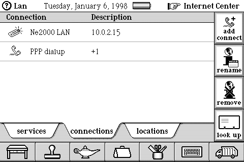
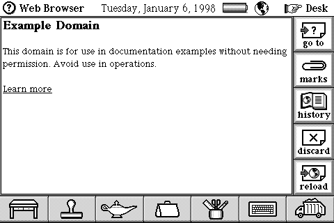

# Networking: what the device can actually do

The working card path described below is DataRover/MIPS, not a verified 68k
configuration.

Measured from the ROM and the package set, before any of it was built. The
point of writing it down first is that it decides the order of the work, and
two of these findings were surprises.

## Internet mail is in the ROM

Not a package. The ROM carries SMTP, POP3, MIME and DNS, with a configuration
UI for each:

- "Enter the SMTP mailer server name:"
- "Fill in the name server IP address:" / "Fill in the numeric DNS address:"
- `MIME-Version: 1.0`, `Content-Type`
- sample values left in the string table: `smtp.<somewhere>.com`,
  `pop3.acme.com`, `smtp.ix.netcom.com`, `pop3.interramp.com`

So pointing the device at our own mail service is the supported path, not a
workaround. Postcards ride on it, being Magic Cap's presentation of a message.

Mail needs no TLS: a private SMTP and POP3 on the host can be plaintext.

## The browser is a package, and it arrives by mail

The ROM has no HTTP or HTML. It has a button that composes a request for one:

> "As the owner of a DataRover 840 you are eligible to receive the DataRover
> Web Browser. To obtain your copy of the Web Browser please send a mail
> message from your DataRover to browser@genmagic.com. When we receive your
> request we will send a copy of the Web Browser to your DataRover by return
> mail."

Software distribution *is* mail on this device. Once our mail service works we
can serve packages by return mail exactly as General Magic did -- their own
channel, no shim.

`packages/WebBrowser40.mc2` is that browser. It is a `SALTCOD` package like
every `.pkg`, with a different extension -- which is why a `*.pkg` search
misses it, as one did here.

It is more capable than expected: HTTP/1.0, HTML including `TABLE`, `FRAME`
and `FRAMESET`, `image/gif` and `image/jpeg` with libjpeg compiled in,
cookies, and forms (`application/x-www-form-urlencoded`). It needs
`packages/MagicJavaScript.pkg`, which supplies JavaScript 1.0 through 1.3.

## No TLS, and no crypto at all to build it on

The browser says so itself:

> "Contacting this location requires a secure connection, which the browser
> does not currently support."

The device has no cryptographic code whatsoever. There is no RSA, no bignum,
no AES, DES or RC4, and no MD5 or SHA anywhere in the ROM. Searching for
"signature" finds ten hits and every one of them is the *handwritten*
signature in the stamper. The browser's only related symbol is
`@ipSSLUnsupportedText`, the error text.

On-device TLS is therefore a from-scratch build -- bignum arithmetic, a key
exchange, X.509 chain validation and a bulk cipher -- for a 36.864 MHz R3900
with 4 MB of RAM shared with the whole OS. For that class of machine a P-256
scalar multiplication runs into seconds and a handshake needs two, so expect
several seconds per connection before any bytes move. It is a real project,
not a patch.

The shape that fits this repo's rules is a *package*, not a ROM patch: it is
how General Magic shipped everything, it leaves the ROM untouched, and it
satisfies "not part of the code, not used to make core features work" by
construction.

## Prior art

https://oldvcr.blogspot.com/2023/01/bringing-tls-to-magic-cap-datarover.html
got a real DataRover onto the modern web with an EtherLink III card and
Crypto Ancienne, a TLS-terminating proxy for vintage clients. Two things to
carry over:

- The proxy approach is proven on this exact device family.
- The author *modified* the browser to speak HTTPS-over-HTTP to the proxy.
  Stock `WebBrowser40.mc2` has no proxy support at all -- no proxy host or
  port setting, no `CONNECT`. So even the proxy route needs a patched browser
  package. That is a package patch, not a ROM patch.

## Addressing

There is no DHCP, BOOTP or RARP in the ROM or in any package. The vocabulary
is entirely manual -- "Your network administrator should assign you an IP
address" -- which is unremarkable for 1998 and cannot be changed without
writing guest software.

It does not matter. A userspace NAT on the host side (what QEMU calls slirp)
means no TAP device, no bridge, no root and no host configuration: we choose
the subnet, answer ARP for the gateway, and the guest's one manual address is
a constant we bake into a banked snapshot.

## PC Link package transfer

The 37,953-byte transfer limit was an incomplete connection handshake.
WinPcLink sends two `Cntd` replies to `Cnct`; our client sent one, leaving a
20-second connection wait to expire while a large package was arriving.
`scripts/pclink` now sends both replies. Ne2000 (67,096 bytes) and WCPack
(126,388 bytes) both transfer completely and the guest resumes command
processing.

This fixes the serial package transport used to install networking software.
The NE2000 card now has packet transport through libslirp userspace NAT.
See the bring-up status and configuration below.

The attached-device warning seen after installation was a separate MBUS
status bug, also reproducible while idle. Reading control-register bit 29
as zero starts accessory enumeration, which fails without a peer and enters
a 60-second recovery cycle that temporarily disables UART A. The empty-bus
model now reports that input high, so the guest finishes discovery with no
devices and exits normally. The polarity is inferred from the ROM's
discovery logic. This does not implement an Ethernet card or network connection.

With this fix, a 126,388-byte WCPack transfer followed by keeping PCLink open
leaves the installed drivers visible with no warning after 108.5 emulated
seconds.

PCLink shutdown is fixed too. WinPcLink sends `Abrt` followed by `GBye` in
both teardown paths; sending `GBye` alone caused the guest's "Part of the data
was lost on the way" warning. `scripts/pclink --hangup` now sends the reference
sequence. A repeated 126,388-byte transfer installed successfully,
disconnected cleanly, and remained warning-free for the rest of a
4,000,000,000-instruction run.

The native client also receives packages sent from the Storeroom. Start it
with a destination directory, connect by tapping the computer, then drop a
package on that computer:

    scripts/pclink /dev/pts/NUMBER --receive received-packages

The guest announces the transfer with `MPkg`. Its fixed 520-byte payload holds
a reserved word, the character count, and a 256-character UTF-16BE name field;
the file data is a separately escaped stream ending at an unescaped `0x0e`.
The client writes to a `.part` file and renames it only after the end marker.
Guest names cannot escape the destination directory, and an existing file gets
a numbered name instead of being overwritten. The destination defaults to the
current directory.

WinPcLink recognizes `APkg`, `Free`, `Flsh`, and `Baud`, consumes their
payloads, and deliberately performs no application action for them. The native
client now does the same explicitly. An incoming `Abrt` is a clean peer abort,
and `GBye` is a clean peer disconnect; either removes an incomplete `.part`
file.

## Dial-up and PPP: useful protocol, wrong hardware path

The ROM distinguishes the built-in fax modem, an external modem, and a modem
PC Card. It speaks plain Hayes. Straight from the string table:

    ATE0V1W2   ATE0V1&d2W2   ATE0V0X4   AT\N0   ATI0   ATL<n>   ATD   ATDT

and it expects the word results OK, CONNECT, BUSY, ERROR, NO CARRIER,
NO ANSWER and RING. PPP is in the ROM too, with its own configuration UI
("Enter your PPP dialup account name:"), alongside a full "Add an Internet
service provider" flow -- `alterdial.uu.net` is still in the string table.
Once a carrier exists, PPP's IPCP can negotiate the guest address, unlike the
NE2000 driver, which asks the user for a fixed address.

That protocol evidence does **not** establish that the Internet modem is on
UART A or B. The DataRover 840 user manual describes the ordinary wireline
connection as the machine's internal fax modem: the telephone line plugs into
the DataRover itself. It describes external modems as accessories connected
through the Magic Bus port, or as modem PC Cards. UART A is the PC Link and
monitor path in this emulator; no evidence shows that Magic Cap presents it
to the Internet connection code as a modem port. Source: the connection and
Internet Center chapters of [Using Magic Cap](https://bitsavers.trailing-edge.com/pdf/generalMagic/Using_Magic_Cap.pdf).

This corrects the earlier plan. Attaching `scripts/modem` to `--serial a`
cannot emulate any documented DataRover Internet hardware. Supporting dial-up
would require one of these actual device paths:

- model enough of the internal modem/telephone path, which appears to meet
  the CPU through the UCB1100 telecom/PCM interface and may leave modem signal
  processing to guest code;
- implement an external modem as a Magic Bus accessory; or
- implement a modem PC Card and its controller-facing interface.

All three require substantial new hardware work before Hayes commands or PPP
can reach the host. `scripts/modem` remains a protocol probe: its loopback test
verifies echo, `ATE0`, `OK`, dialing, `CONNECT`, and PPP frame recognition, but
it has not received bytes from Magic Cap and is not a working guest device.

The shortest supported route to outbound Internet access is therefore the
installed NE2000 PC Card driver plus an emulated NE2000 card and userspace NAT.
PC Link now transfers both required packages completely, so the package-size
dependency that originally favored a package-free route is already resolved.

## Digits, and why they were never on the keyboard

Neither of us could make the on-screen keyboard produce a digit, having tried
every part of the abc|123 control, both scroller arrows, caps, symbols,
expand, and the option key held across each. The reason is that it does not
work that way.

The ROM holds several *specialised* keyboards, each a Telescript object with
a reference to the next, and the field chooses between them:

| object | layout |
|---|---|
| `80015BF1` | `qwertyuiopasdfghjklzxcvbnm,.'` -- ordinary text |
| `80015C21` | `1234567890!@#$%~&()_-*+=:",./` -- digits |
| `80015C79` | `qwertyuiopasdfghjklzxcvbnm@./` -- `@`, `.`, `/`: addresses |

So there is no "switch to 123" gesture to find, and tapping at a text field
was never going to produce one: that field had already been given the text
keyboard. The Japan ROM carries the same three at the same relative offsets,
differing only in `^` where the USA build has `~`, which is a useful check
that the decoding is right.

Digits on screen are a different thing again: the Phone has its own **keypad**
-- Desk, then the telephone, then "location", then "keypad" in the sidebar --
a plain 3x4 telephone pad with a dial button. Its grid is exactly regular,
columns at x 35/95/157 and rows at y 59/120/181/242, and scripts/type carries
it.

## The Phone application is not an Internet modem test

Tapping out 5551234 on that keypad and pressing dial puts up "Phone status --
Calling 5551234" with a running timer. The navigation and the digits are
therefore both good.

What it does not do is drive the Internet transport. Zero bytes leave UART A
or UART B, and the observed call produced no UCB1100 telecom-register writes.
The Phone application's call screen therefore does not prove which hardware
the Internet provider code uses. The user manual supplies the missing hardware
distinction above.

## Order of work

1. The link: NE2000 card model and userspace NAT — implemented; plain HTTP
   browsing is verified below.
2. Mail: host DNS, SMTP and POP3. Needs no TLS. Delivers postcards.
3. Package-by-mail, which is the ROM's own mechanism.
4. HTTPS browsing, via a patched browser package and a TLS-terminating proxy.
5. On-device TLS, if it is ever worth the months.

## Why NE2000 rather than EtherLink III

We have driver packages for both. NE2000 is chosen for the *emulator's* sake:
the DP8390 is simple, exhaustively documented and has no undocumented
behaviour worth the name, where the 3c589 does. The blog used EtherLink III
because that was the card in the slot; we are writing the card, so we get to
pick the one that can be modelled honestly.

## NE2000 bring-up (2026-09-11)

`--ne2000 1` (or `2`) selects the card model in that slot. `--net user`
connects it to libslirp NAT, defaulting to slot 1 if no slot is specified.
Without `--net user`, the Ethernet cable is disconnected. A memory-card
image cannot occupy the same slot. `--card-at` delays
insertion and `--log-card N` reports the first N accesses. The stock USA ROM
is used unchanged; WCPack and Ne2000 are installed through PCLink.

### What is measured

- The archived driver ReadMe names Socket LP and SohoWare ND5100 as supported
  cards. The package contains the `NDC` / `Ethernet` product identity; Linux
  `pcnet_cs.c` recognizes it too. Our CIS describes a compatible card, not an
  exact dump of a physical ND5100.
- The ROM reads CIS tuples through **window A**, at even byte addresses:
  `0x13C2DB50` reads tuple codes and `0x13C2D8F0` reads their lengths.
  `0x13C2DE64` copies tuple data into RAM. This supersedes the assumption that
  both windows can always serve identical bytes.
- Before the controller fix, changing card detect in a running session
  produced no card reads. With edge latches and board interrupt routing,
  insertion reaches `0x13C1FFEC`, then `0x13C2C3B4` and `0x13C33824`, followed
  by CIS reads. No forced CPU IRQ or guest function injection is used.
- Glacier `+0x10..0x16` are interrupt enables; `+0x18..0x1E` are corresponding
  pending/W1C words. The shared ROM handler explicitly intersects these pairs.
  Its acknowledgement of TX39 bank 3 bit 2 identifies CARDDIR/MFIO1 as the
  shared interrupt input. Rising/falling event polarity is inferred from the
  paired enables and active-low card-detect inputs; live insertion was checked.
- A card without the guest driver receives the card-rejection popup. With
  WCPack and Ne2000 installed, the same identity is accepted without that
  popup. A separate connection attempt now establishes initialization in
  **both slots**, rather than relying on recognition alone.
- The driver writes COR `80 → 00 → 60` at attribute offset `0x3F8`, then
  accesses NIC registers at **window A + `0x300..0x31F`**. Window B remains
  untouched. Glacier `+0x20` bit 3 toggles around odd-byte accesses in the
  ROM's `0x13C34A50`/`0x13C34B34` helpers; this is not a persistent
  attribute/I/O mode switch. The model decodes the observed range; the full
  decoder and other aliases are still unknown.
- The guest reads all 32 station-PROM bytes and programs MAC
  `02:00:00:84:00:01` (slot 1) or `02:00:00:84:00:02` (slot 2), DCR `49`,
  PSTART/BNRY `46`, PSTOP `80`, CURR `47`, IMR `3F`, RCR `04`, TCR `00`.
  It then writes 64 bytes to packet RAM at `0x4000`, acknowledges remote-DMA
  completion, and requests transmission with CR `26`.
- The first packet is a broadcast ARP request for the guest's own
  `10.0.2.15` address. The guest's word stores contain EtherType `0806`;
  the board interface swaps words around the core's little-endian data port
  so packet RAM preserves Ethernet byte order. Duplicated PROM bytes alone
  would not have detected this error. A unit test checks asymmetric bytes.

The verified run ends with:

```text
ne2000: COR=60 CR=22 ISR=00 IMR=3F DMA=32 read/64 written, 3 unsupported accesses
ne2000: MAC=02:00:00:84:00:01 ring=46..80 BNRY=46 CURR=47 TX requests=1
```

That trace records the earlier initialization-only milestone. Two reads of
reserved page-0 offsets `0x0A/0x0B` still float high and are counted. The
transmit request is now implemented; it succeeds when connected to the backend
and reports carrier loss when disconnected.

The guest setup path is Internet Center → Setup → other Internet provider.
After naming the provider, its Connections tab → add connection → scroll down
exposes **Ne2000 LAN**. Its IP field opens the numeric keyboard directly.
The test configuration uses `10.0.2.15`; the DNS service uses `10.0.2.3`.
These match the implemented NAT subnet. The host/gateway address is `10.0.2.2`.

For the minimal mail-driven test, finish owner setup and choose a calling
location. Configure a POP mailbox (`host`, account `test`, blank password),
DNS and the NE2000 connection. Remove the unused, unfinished SMTP and PPP
entries by **dragging their icons to the trash truck**; the sidebar “remove”
button deletes the whole provider. Leaving those entries unfinished causes
“Your setup for Lan is incomplete” before the driver runs. The temporary
provider's name is `Lan`.

From a Desk snapshot prepared this way, this replay reaches initialization:

```sh
./build/mhat --rom roms/MagicCap-USA.image --headless --no-host-battery \
  --load-state /tmp/datarover-ne2000/minimal-desk.state \
  --ne2000 1 --card-at 20000000 --log-card 4000 \
  --codec-gpio '100,260000000;000,360000000' \
  --taps-px '205,90,300000000;320,170,500000000' \
  --tap-hold 30000000 -n 650000000
```

The GPIO input is the Option key: Option-tapping Inbox opens the mail
connection dialog, then the second tap presses “mail.” Changing `--ne2000`
to `2` verifies the other slot. The CLI also supports one physical drag via
`--drag-px 'x1,y1,x2,y2,at'`, with duration set by `--tap-hold`; it cannot be
combined with scripted taps in the same run. None of these inputs patches
ROM, RAM, or saved guest state.



### Model and limits

The NIC implements station PROM reads, 16 KiB packet RAM, remote DMA,
register pages, TX completion and RX ring storage. TX completes after the
10 Mbit/s frame time. Received frames get a status/next-page/length header
and FCS; the ring wraps at PSTOP and protects unread pages behind BNRY.
Physical-address, broadcast, multicast-hash and promiscuous-physical filters apply.
Overflow and missed-packet counters are modeled. Host transport frames carry
no FCS; the model supplies it when storing received packets.

The host adapter lives in `src/host/network.c`, independent of the NIC and
architecture. It uses libslirp's public callbacks and nonblocking `poll()`,
with timers driven by guest time. No TAP device, bridge, elevated privileges,
or guest instruction patches are needed. `--net-pcap PATH` records Ethernet
frames on both sides, timestamped in emulated time. The same board tick drives
networking in headless and SDL runs.

The packet tests cover transmit timing/completion, carrier loss, receive ring
wrap, boundary protection, filtering, interrupt acknowledgement, CRC byte
order and counter behavior. The libslirp integration test opens a local HTTP
server and exercises ARP, an outbound TCP handshake, a GET, and its response.
This is separate from the live guest tests below.

The model is not cycle-accurate Ethernet: complete host frames enter the
receive ring atomically, and collision/error injection and all loopback
modes are not implemented. The tested driver uses DCR `49` and ordinary
16-bit remote DMA; other bus-width/byte-order modes need further validation.

Power/reset timing, full Glacier window decoding and board-level bus timing
remain incomplete. Snapshot version **5** rejects earlier states because the
old Glacier register file stored acknowledgement writes as persistent values.
Create fresh baseline states with this build. Snapshots with a NE2000 inserted
are currently rejected because card-state serialization is not implemented;
save the driver-installed guest before insertion for repeatable experiments.

### Packet transport validation

The first connected test exposed a wrong interrupt mapping in the initial
model. The installed drivers enable **falling Glacier bit 2** (`+1C=4`, then
`+14 |= 4`) and disable bit 3 after initialization. Bit 3 supplies the ROM's
readiness check; it does not deliver the NIC interrupt. The model now drives
I/O-card IRQ through bit 2, which the existing shared ROM handler dispatches.
The complete physical mux inside Glacier is still undocumented.

With that correction, the stock guest sends its initial ARP probe, resolves
`10.0.2.3`, sends a DNS query for the temporary POP server `host`, reads the
reply and reports that the server cannot be found. The capture and driver
counters agree: three transmitted frames, two received, boundary advanced
from `46` to `48`, current page from `47` to `49`, and no ring overflow.
Scratch evidence was `nat-irq2.log` and `nat-irq2.pcap` under
`/tmp/datarover-ne2000/`, since deleted. This establishes bidirectional guest packet
handling and a host-resolver round trip, not a successful mail session.

The same guest resolves `example.com` through the host resolver, then ARPs
for the returned public address directly. The virtual router therefore
implements **proxy ARP** for off-subnet unicast IPv4 destinations, advertising
its own MAC for those addresses. It leaves local-subnet ARP to libslirp and
never answers the guest's duplicate-address probe. This supplies network-side
routing for the observed guest behavior; the guest is unchanged. The reply
mechanism is described in [RFC 1027 section 2.1](https://www.rfc-editor.org/rfc/rfc1027.html#section-2.1).
`external.pcap` records the unanswered off-subnet requests before this change;
`external-proxy.pcap` records the response and subsequent unicast TCP SYN.
The temporary POP test points at port 110, so it does not establish a working
service on the public web server.

### Guest browser validation (2026-09-11)

With WCPack, Ne2000, Web Browser 4.0 and MagicJavaScript installed through
PCLink, the stock 4 MB guest now renders both a local HTTP page and
`http://example.com/`. The public-page test completes DNS resolution, proxy
ARP, the TCP handshake, HTTP GET/200 response, and both FIN acknowledgements.
It passed in **both card slots** (10 frames transmitted, 8 received, zero
receive-ring overruns per run).



This test found a second interrupt bug after the pin mapping was corrected:
NIC and Glacier outputs were sampled only once per 1024-instruction CPU
batch. A register acknowledgement could deassert the line and the next
packet could assert it again before that sample, hiding the edge. The public
HTTP response arrived, but its FIN and subsequent packets stayed unread
(`ISR=03`, boundary `4F`, current page `56`). Board bus wrappers now propagate
NIC ISR/IMR/reset changes and Glacier mask/W1C changes immediately. Packet
arrival and transmit completion also propagate at the device tick. No guest
code or memory is modified. The regression test exercises successive DMA
interrupts, masking/unmasking and reset reads in both sockets without an
intervening board tick.

The browser asks for confirmation before receiving the 45 KB test page.
Until **continue** is tapped, its TCP window deliberately closes; that is
application backpressure, not a stalled PCLink transfer or NIC overflow.

The confirmed large transfer delivered **45,607 body bytes**, all
acknowledged by the guest and byte-for-byte identical to the served file
(SHA-256 `19daf09d1802bf8c4b51e552365450ab8ee43915606900cf38961f46a4fed075`).
The page renders successfully. The combined small/large-page run ends with
78 transmitted frames, 73 received, zero overruns and `ISR=00`. This exceeds
the NIC's 16 KB RAM and exercises receive-ring reuse and wrap.

### Slow-transfer follow-up

Two independent bugs were reproduced and corrected:

- **libslirp loses the SYN MSS after an asynchronous host connect.** The
  original 4.7.0 backend sent 1440-byte TCP payloads despite Magic Cap's
  536-byte offer. After the confirmation dialog, the guest's small window
  made the backend send roughly one 720-byte burst every five seconds.
  [The saved-connect continuation in upstream `tcp_input.c`](https://qemu.googlesource.com/libslirp/+/refs/tags/v4.7.0/src/tcp_input.c)
  restored the TCP header but left the options pointer null. The local
  [dependency patch](../patches/libslirp-4.7.0-syn-mss.patch) restores those
  already-validated options from the retained packet before normal option
  processing. This fixes negotiation in the virtual router; the guest's
  window, MSS, ROM and software are unchanged.
- **The NIC rejected `BNRY=PSTOP` on an exact ring wrap.** Faster traffic
  exposed the guest writing boundary `80` with ring `46..80`, current `46`.
  Our range check then dropped every incoming frame as unsupported.
  DP8390D section 7 specifies wrapping the next page at PSTOP and *then*
  comparing it with BNRY. An out-of-ring boundary cannot match; it does not
  disable reception. The model now implements that comparison, including
  equal CURR/BNRY at initialization. An in-ring boundary still prevents
  overwriting unread data.

Using the same 45,607-byte page, stock 4 MB snapshot and scripted taps:

| Packet-capture measurement | Before | After both fixes |
| --- | ---: | ---: |
| HTTP GET to final body acknowledgement (emulated seconds) | 309.331 | 63.290 |
| Largest TCP payload (bytes) | 1440 | 536 |
| Body bytes received and acknowledged | 45,607 | 45,607 |

That is **4.9 times faster**, including the same confirmation-dialog delay.
The page renders; the combined small/large-page run finishes with 169 TX,
96 RX, zero overruns and `ISR=00`. All 16 CTest suites pass.
The complete response still matches SHA-256
`19daf09d1802bf8c4b51e552365450ab8ee43915606900cf38961f46a4fed075`.
The remaining pauses follow guest acknowledgements and window updates;
this measurement is not a claim about real hardware throughput. The public
`example.com` page also renders with the patched backend in slot 2.

The network regression test fails against the original library and passes
with the patch. It verifies full 8,000-byte HTTP bodies with MSS offers
256, 536 and 1200, plus a connection without an MSS option. It tests small
receive windows and a zero-window pause/reopen. The NIC regression separately
reproduces the rejected wrap, checks equal-pointer initialization, and checks
that a genuine boundary collision still causes overrun.

The patched dependency is built locally by `scripts/build-slirp`, pinned to
upstream v4.7.0 commit `3ad1710a96678fe79066b1469cead4058713a1d9`. It applies
only the checked-in patch and installs under `build/slirp-fixed`, without
changing system libraries. Startup identifies it with the `mh-mss1` suffix
(the upstream version generator also labels the patched tree `dirty`). The
script accepts reruns of its exact patch and refuses unrelated source edits.

Saved states with the networking packages installed contain licensed guest
software, so none are in the repository. Once you have saved one with the
packages installed, the provider configured and a URL entered in the browser,
resume it with networking attached:

```sh
./build/mhat --rom roms/MagicCap-USA.image \
  --load-state states/browser.state --net user
```

Press **go** after the card initializes. This snapshot is already awake;
pressing F4 unnecessarily can put it to sleep. For a local HTTP server,
listen on the host's loopback interface and use `10.0.2.2` from the guest.

### Build and launch

The tested build uses the local libslirp patch above. Install the build tools
(`git`, `meson`, `ninja-build`, `pkg-config`, and `libglib2.0-dev` on Debian or
Ubuntu), then run:

```sh
scripts/build-slirp
PKG_CONFIG_PATH="$PWD/build/slirp-fixed/lib/pkgconfig" \
  cmake -S . -B build -U 'SLIRP_*' -U '__pkg_config_checked_SLIRP' \
  -U 'pkgcfg_lib_SLIRP_*'
cmake --build build -j
./build/mhat --rom roms/MagicCap-USA.image \
  --load-state /path/to/driver-installed-desk.state \
  --net user --net-pcap /tmp/datarover.pcap
```

System libslirp development packages remain supported through pkg-config,
but affected versions fail the MSS regression and exhibit the slow bursts.
The cache removals above switch an existing build to the patched dependency.
`MESON=/path/to/meson scripts/build-slirp` selects a non-system Meson.
Detection is optional: builds without libslirp retain an unconnected NIC,
and `--net user` reports that the backend is unavailable.

The guest still needs WCPack/Ne2000 installed and its provider configured.
Web Browser 4.0 additionally needs `MagicJavaScript.pkg`; both packages can
be installed through PCLink. A long unattended run can enter the guest's
power-saving state: **F4** presses/releases the real power-button input in
SDL. `--power-at 20000000 --tap-hold 30000000` provides the same input for
headless runs. TX39 ONBUTN and its positive/negative edge interrupts come
from the NetBSD power/ICU register definitions; the ROM handles the wakeup.
A browser-installed snapshot that ignored touch resumed normally after this
input and accepted the next PCLink transfer.

HTTP works through the native TCP/IP stack; the existing browser's lack of
TLS is unchanged. HTTPS needs separate browser/proxy work.

References:

- [libslirp public API](https://gitlab.freedesktop.org/slirp/libslirp/-/blob/master/src/libslirp.h), callbacks, polling and configuration.
- DP8390D datasheet, sections 7 and 9–11.
- [Linux pcnet_cs.c](https://github.com/torvalds/linux/blob/master/drivers/net/ethernet/8390/pcnet_cs.c), card matching.
- [Linux firmware NE2K.cis](https://github.com/wkennington/linux-firmware/blob/master/cis/NE2K.cis), CIS configuration layout.
- [NetBSD tx39icureg.h](https://github.com/NetBSD/src/blob/trunk/sys/arch/hpcmips/tx/tx39icureg.h), CARDDIRPOSINT/MFIO edge sources.

Local traces and test states were under `/tmp/datarover-ne2000/`, which was
temporary and has been deleted: the replay commands above name
`minimal-desk.state`, which has to be prepared again from a Desk snapshot as
described. Driver-installed stock
baseline: `v5-ne.state`; configured Desk: `minimal-desk.state`; insertion
trace: `driver-probe.log`; initialization traces: `verified.log` and
`slot2.log`; test output: `ctest-final2.log`. These are
scratch artifacts, not distributed regression fixtures.
