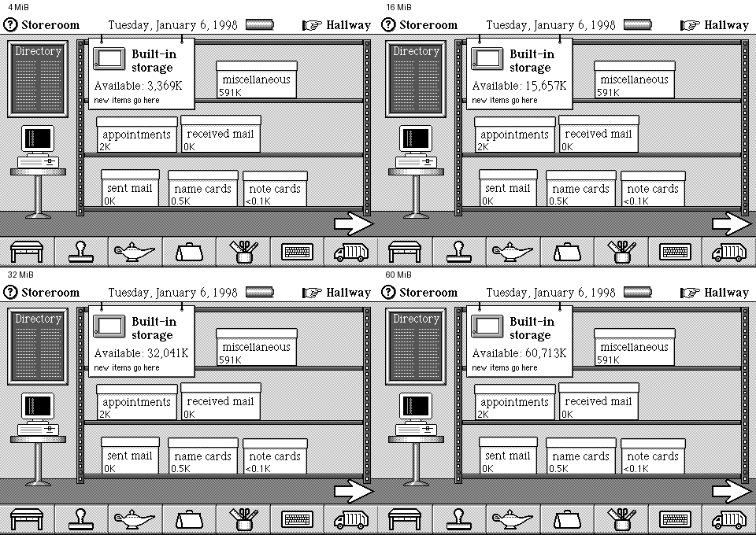
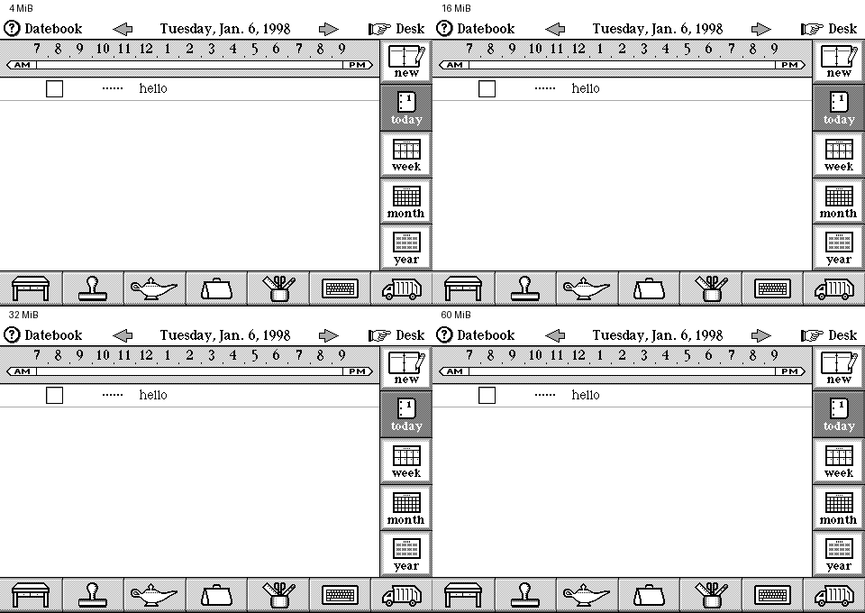

# DataRover RAM expansion experiment

Measured using the shipping USA Magic Cap 3.1.2j ROM
(`DataRover-840-USA.image`). This is an intentional modification of the
DataRover configuration, not a claim about physical DataRover hardware or
68k Magic Cap. See [MODIFICATIONS.md](MODIFICATIONS.md)
for the three constants involved.

## Results

| Exposed RAM | Storeroom available built-in storage | Framebuffer physical address |
|---|---:|---|
| 4 MiB (stock) | 3,369K | `003F6A00` |
| 16 MiB | 15,657K | `00FF6A00` |
| 32 MiB | 32,041K | `01FF6A00` |
| 60 MiB | 60,713K | `03BF6A00` |

The storage increases are exactly 12,288K, 28,672K and 57,344K over stock:
one KiB of additional reported storage for every KiB of added RAM. The
built-in storage placard, not just the monitor's memory banner, reports
this. The framebuffer remains at RAM end minus `0x9600`.



All four configurations freshly booted, accepted calibration and rendered
Controls and Storeroom with zero bus faults. The initial startup images
were byte-identical. Read-only inspection of saved RAM also confirmed that
the monitor globals at `0xC180` and `0xC1C4` and the OS total at `0xDFE0`
all held the selected byte count. No runtime ROM patches, snapshot edits,
guest RAM edits or injected ROM function calls were used.

All four also created a Datebook appointment reading `hello` through the
on-screen keyboard. A subsequent snapshot reload closed the keyboard,
returned to Desk and reopened Datebook, then continued for a total of
2 billion execution slots. The appointment remained visible in every run;
all seven recorded stages per configuration exited successfully with zero
bus faults. This verifies ordinary object creation and snapshot
persistence, not persistence across a cold restart without a state.



**60 MiB is the highest size tested within the current emulator mapping.**
RAM occupies physical `0x00000000..0x03BFFFFF`; the ROM starts at
`0x03C00000`. Going higher requires investigating the board address decoder
and ROM/OS assumptions, not simply relaxing the command line's size
validation. These are boot, storage-reporting and small-object activity
checks, not a full-memory stress test. The appointment text is allocated at
RAM `0x85D60` in all four trials; it does not demonstrate object allocation
beyond the original 4 MiB. Filling the expanded object store, large package
imports, out-of-memory handling and long-term stability remain untested.
Neither a 32-bit CPU address space nor these results establish Magic Cap's
absolute maximum RAM. Other ROMs and the 68k machines remain untested.

## Offline ROMs

Each expanded ROM changes only the three instructions described in
[MODIFICATIONS.md](MODIFICATIONS.md). Patch the original image into a new
file:

```sh
mkdir -p roms/experimental
scripts/patch-rom patches/datarover-usa-60mb.json \
    roms/DataRover-840-USA.image roms/experimental/DataRover-840-USA-60mb.image
./build/mhat --rom roms/experimental/DataRover-840-USA-60mb.image
```

No `--ram` is required: the emulator reads the agreeing size constants.
Separate manifests are supplied for 8, 16, 32 and 60 MiB. All require
source SHA-256
`94785cb334f14eac00ed200af014c35972b4f25694103bc6a49b3afa280a6f1b`.

| MiB | Patched image SHA-256 |
|---|---|
| 16 | `9e776a1f3b4884abafa1b40893d9a8f13659859633ce3b12ba7814f8be6a0d98` |
| 32 | `bf65b36c589e6af042ea221a46f2e049c3ef3c531fd5c5e8f0429a8127254935` |
| 60 | `b6a7dec6d38a1a183da37084ab590921d98c2646b978dfd7c7bd4500c971dde0` |

## Reproduction

Run the following from the repository root, using an unused output
directory and a ROM created by the offline patch tool (or the stock image
for a baseline). All stage budgets are emulator execution slots, not
measured boot times. Each stage passes `--save-state`, so none of them read
or write the device's own saved state.

```sh
ram_trial=/tmp/datarover-60mb-trial
ram_rom=roms/experimental/DataRover-840-USA-60mb.image
mkdir "$ram_trial"
ram_stage() {
    ram_name=$1
    shift
    ./build/mhat --rom "$ram_rom" --headless --no-host-battery \
        --dump-fb "$ram_trial/$ram_name.pgm" \
        --save-state "$ram_trial/$ram_name.state" "$@" \
        > "$ram_trial/$ram_name.log" 2>&1
}
ram_stage boot -n 2000000000
ram_stage cal --load-state "$ram_trial/boot.state" -n 400000000 \
    --tap 500 500 5000000 --tap-hold 20000000
ram_stage desk --load-state "$ram_trial/cal.state" -n 450000000 \
    --taps '120,120,20000000;800,740,140000000;460,430,260000000' \
    --tap-hold 45000000
# Dismiss startup notices; these coordinates finish in Controls.
ram_stage clean --load-state "$ram_trial/desk.state" -n 400000000 \
    --taps-px '413,61,20000000;393,22,120000000;413,61,220000000' \
    --tap-hold 30000000
ram_stage storage --load-state "$ram_trial/clean.state" -n 750000000 \
    --taps-px '430,12,20000000;451,251,270000000;65,116,520000000' \
    --tap-hold 20000000
ram_stage appointment --load-state "$ram_trial/clean.state" -n 900000000 \
    --taps-px "33,298,20000000;435,160,200000000;$(scripts/type --at 350000000 HELLO)" \
    --tap-hold 20000000
ram_stage resumed --load-state "$ram_trial/appointment.state" -n 2000000000 \
    --taps-px '456,303,20000000;440,12,200000000;435,160,400000000' \
    --tap-hold 20000000
```

Inspect rendered images and guest behaviour; a zero process exit alone
does not prove successful navigation. Keep experimental states out of the
stock regression fixtures. A snapshot restores its embedded flash, so
always use states derived from the intended ROM, even when `--rom` names
another file.
